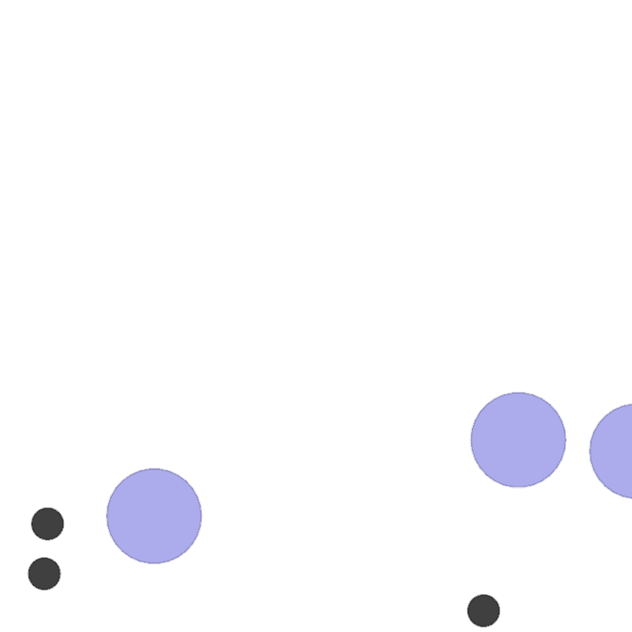
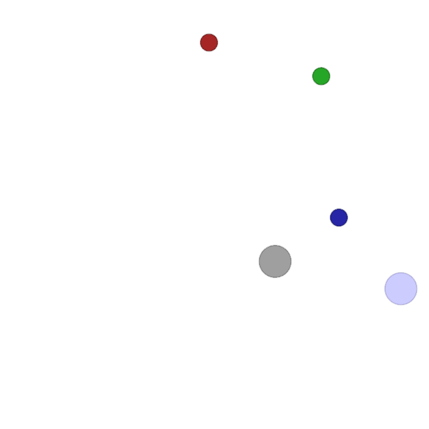
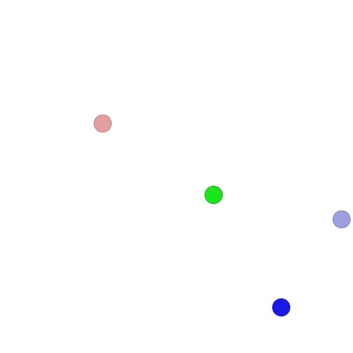

# Multi-Agent Generative Adversarial Imitation Learning (Ongoing)

This repository contains the PyTorch implementation of the Multi-Agent Generative Adversarial Imitation Learning (MAGAIL) and Adversarial Inverse Reinforcement Learning (AIRL) algorithms,
originally implemented in TensorFlow version 1. The code in this repository is a conversion of the codebase from TensorFlow v1 to PyTorch, making it more accessible and compatible for research purposes.

## Original TensorFlow Version
The original TensorFlow version of this implementation can be found in the following repository:

[Link to the Original TensorFlow Repository](https://github.com/ermongroup/multiagent-gail)

## Results

### sample spread

### simple speaker listener

### simple push

